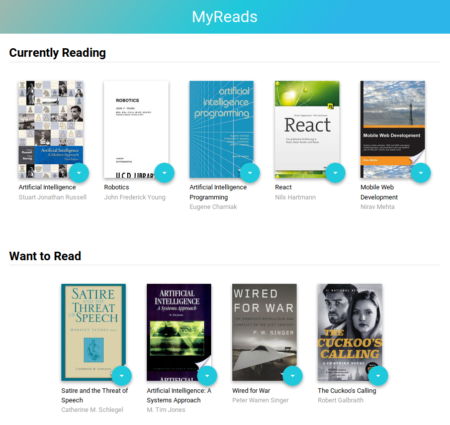

# MyReads Project Overview

This application was created with ReactJS for the Grow with Google / Udacity Front-End Web Developer program. The app allows users to search for books and move them between three different shelves.

## Instructions

To load the application locally:

* Install project dependencies by typing `npm install` from your terminal.
* Install the react package: `npm install -g create-react-app`
* Clone this repository: `git clone https://github.com/rustyabbott/react-myreads.git`
* From the project root type `npm start`

## Acknowledgements

* [Udacity](https://www.udacity.com/)
* [Forrest Walker](https://forrestwalker.net/)
* [Ryan Waite](https://www.youtube.com/channel/UCRb4dFjhmm8RfvTgIfBtXFg)
